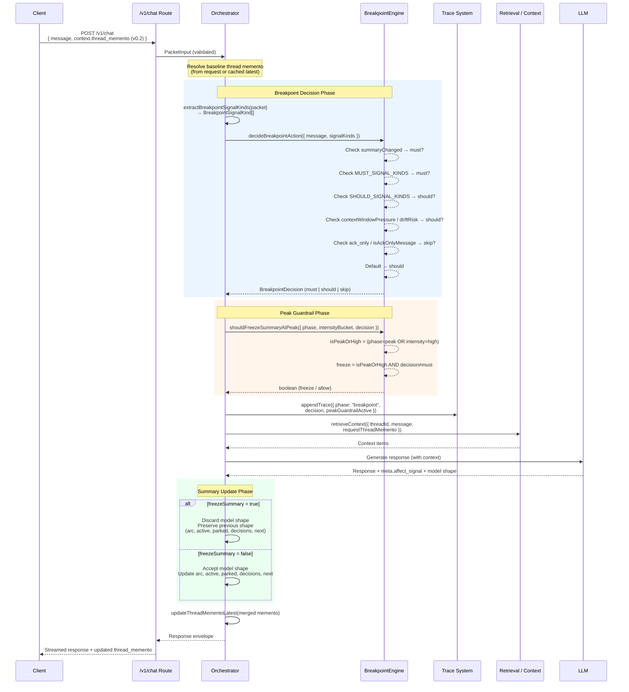

# Breakpoint Engine

## Overview

The Breakpoint engine is a deterministic decision layer in solserver's control plane that classifies every incoming conversational turn as **must**, **should**, or **skip**. This classification controls how aggressively the system processes the turn — whether thread-level summary fields (arc, active threads, parked threads, decisions, next steps) are updated, and whether expensive downstream work is justified.

A complementary **peak guardrail** prevents summary churn during emotionally intense conversation phases by freezing summary updates unless the breakpoint decision is `must`.

### Source files

| File | Role |
|------|------|
| `src/control-plane/breakpoint_engine.ts` | Core decision logic, types, and peak guardrail |
| `src/control-plane/orchestrator.ts` | Wiring: signal extraction, decision invocation, summary freeze, trace recording |
| `src/contracts/chat.ts` | Zod schemas for `ThreadMementoSignalKind`, `ThreadMementoSignalItem`, `ThreadMementoSignals` |
| `test/breakpoint_engine.test.ts` | Unit tests for decision engine and guardrail |
| `test/thread_memento_latest.test.ts` | Integration tests for peak guardrail with memento updates |

---

## Types

### `BreakpointDecision`

```typescript
type BreakpointDecision = "must" | "should" | "skip";
```

| Value | Meaning |
|-------|---------|
| `must` | Critical decision point. Summary fields **must** be updated and full processing is required. Cannot be skipped even during peak intensity. |
| `should` | Standard processing. Summary fields are updated under normal conditions but may be frozen at peak intensity. |
| `skip` | Acknowledgment-only turn. The message carries no decision weight and summary updates can be skipped entirely. |

### `BreakpointSignalKind`

```typescript
type BreakpointSignalKind =
  | "decision_made"
  | "scope_changed"
  | "pivot"
  | "answer_provided"
  | "ack_only"
  | "open_loop_created"
  | "open_loop_resolved"
  | "risk_or_conflict";
```

| Signal | Category | Description |
|--------|----------|-------------|
| `decision_made` | MUST | The user or assistant committed to a key decision that changes the thread's direction. |
| `scope_changed` | MUST | The conversation scope expanded or narrowed (e.g., new topic introduced, constraint added). |
| `pivot` | MUST | An abrupt change in topic or direction occurred. |
| `answer_provided` | MUST | A direct, substantive answer was given to a question. |
| `ack_only` | (skip) | The message is purely an acknowledgment with no decision content. |
| `open_loop_created` | SHOULD | A new task, question, or open loop was introduced that needs future resolution. |
| `open_loop_resolved` | SHOULD | A previously open task or question was completed or answered. |
| `risk_or_conflict` | SHOULD | A risk, conflict, or tension was detected in the conversation. |

---

## Signal Classification

Signals are partitioned into two constant sets that drive the decision priority chain:

```typescript
const MUST_SIGNAL_KINDS = new Set<BreakpointSignalKind>([
  "decision_made",
  "scope_changed",
  "pivot",
  "answer_provided",
]);

const SHOULD_SIGNAL_KINDS = new Set<BreakpointSignalKind>([
  "open_loop_created",
  "open_loop_resolved",
  "risk_or_conflict",
]);
```

The `ack_only` signal is not in either set — it is handled as a special case that produces `skip`.

---

## Functions

### `isAckOnlyMessage(message: string): boolean`

**Location:** `src/control-plane/breakpoint_engine.ts:26-54`

Determines whether a user message is purely an acknowledgment (e.g., "ok thanks", "sounds good", "yep!") and carries no decision-relevant content.

**Algorithm:**

1. Normalize the input: trim, lowercase, strip punctuation (`.,!?`), collapse whitespace.
2. Tokenize on spaces.
3. Check whether **every** token belongs to the ack token set:

```
ok, okay, kk, thx, thanks, got, it, sounds, good, cool, yep, yup, sure, all, right
```

4. Return `true` only if all tokens match. An empty message returns `false`.

**Examples:**

| Input | Result | Reason |
|-------|--------|--------|
| `"ok thanks"` | `true` | Both tokens in ack set |
| `"Sounds good!"` | `true` | After normalization, both tokens match |
| `"ok let's do it"` | `false` | `"let's"` and `"do"` are not in the ack set |
| `""` | `false` | Empty message |

---

### `decideBreakpointAction(args): BreakpointDecision`

**Location:** `src/control-plane/breakpoint_engine.ts:56-71`

The main decision function. Evaluates the incoming message and its associated signals to produce a `must`, `should`, or `skip` decision.

**Parameters:**

```typescript
{
  message: string;                    // The user message text
  signalKinds?: BreakpointSignalKind[];  // Signals extracted from the request
  contextWindowPressure?: boolean;    // True if context window is under pressure
  driftRisk?: boolean;                // True if conversation drift risk is detected
  summaryChanged?: boolean;           // True if the summary was modified externally
}
```

**Decision rules (evaluated in priority order — first match wins):**

| Priority | Condition | Decision |
|----------|-----------|----------|
| 1 | `summaryChanged` is `true` | `must` |
| 2 | Any signal is in `MUST_SIGNAL_KINDS` | `must` |
| 3 | Any signal is in `SHOULD_SIGNAL_KINDS` | `should` |
| 4 | `contextWindowPressure` or `driftRisk` is `true` | `should` |
| 5 | Signal includes `ack_only` OR message passes `isAckOnlyMessage()` | `skip` |
| 6 | No rule matched | `should` (default) |

**Key behaviors:**

- MUST signals always win — even if the message text looks like an ack, a `decision_made` signal will override it.
- Context window pressure and drift risk only promote to `should`, never to `must`.
- The default is `should`, meaning any message that is not clearly an ack and has no signals will still trigger standard processing.

---

### `shouldFreezeSummaryAtPeak(args): boolean`

**Location:** `src/control-plane/breakpoint_engine.ts:73-80`

The **peak guardrail**. Prevents summary updates during intense conversation phases to avoid churn and incoherent summary snapshots.

**Parameters:**

```typescript
{
  phase?: "rising" | "peak" | "downshift" | "settled";  // Current affect phase
  intensityBucket?: "low" | "med" | "high";              // Current affect intensity
  decision: BreakpointDecision;                           // The breakpoint decision
}
```

**Logic:**

```
isPeakOrHigh = (phase === "peak") OR (intensityBucket === "high")
freeze = isPeakOrHigh AND (decision !== "must")
```

| Condition | Freeze? | Rationale |
|-----------|---------|-----------|
| Peak/high intensity + `should` or `skip` | Yes | Conversation is too volatile; summary updates would be unreliable. |
| Peak/high intensity + `must` | No | A `must` decision is critical enough to force an update even at peak. |
| Not at peak/high + any decision | No | Normal conditions; allow updates. |

---

## Data Contract

The signal data flows from the client through Zod-validated schemas defined in `src/contracts/chat.ts:27-49`.

### `ThreadMementoSignalKind`

```typescript
const ThreadMementoSignalKind = z.enum([
  "decision_made", "scope_changed", "pivot", "answer_provided",
  "ack_only", "open_loop_created", "open_loop_resolved", "risk_or_conflict",
]);
```

### `ThreadMementoSignalItem`

```typescript
const ThreadMementoSignalItem = z.object({
  endMessageId: z.string().min(1),       // Message ID the signal is anchored to
  kind: ThreadMementoSignalKind,          // Signal type
  confidence: z.enum(["low", "med", "high"]),  // How confident the signal source is
  source: z.enum(["server", "model"]),    // Who produced the signal
  summary: z.string().max(180).optional(), // Optional human-readable summary
}).strict();
```

### `ThreadMementoSignals`

```typescript
const ThreadMementoSignals = z.object({
  updatedAt: z.string().datetime(),                      // Last update timestamp
  items: z.array(ThreadMementoSignalItem).max(8).default([]),  // Up to 8 signal items
}).strict();
```

The `items` array is capped at 8 entries to bound payload size while preserving enough recent signal history for the breakpoint engine.

---

## Orchestrator Integration

The orchestrator (`src/control-plane/orchestrator.ts`) is the main consumer of the breakpoint engine. Integration happens in three steps:

### 1. Signal Extraction

```typescript
// orchestrator.ts:324-331
function extractBreakpointSignalKinds(packet: PacketInput): BreakpointSignalKind[] {
  const items = packet.context?.thread_memento?.signals?.items ?? [];
  const kinds: BreakpointSignalKind[] = [];
  for (const item of items) {
    kinds.push(item.kind);
  }
  return kinds;
}
```

Pulls signal kinds from `packet.context.thread_memento.signals.items` — the v0.2 thread memento payload sent by the client.

### 2. Decision and Guardrail Evaluation

```typescript
// orchestrator.ts:2337-2345
const breakpointDecision = decideBreakpointAction({
  message: packet.message,
  signalKinds: extractBreakpointSignalKinds(packet),
});

const peakGuardrailActive = shouldFreezeSummaryAtPeak({
  phase: baselineThreadMemento?.affect?.rollup?.phase,
  intensityBucket: baselineThreadMemento?.affect?.rollup?.intensityBucket,
  decision: breakpointDecision,
});
```

The orchestrator feeds the user message and extracted signal kinds into `decideBreakpointAction`, then evaluates the peak guardrail against the baseline thread memento's affect rollup state.

### 3. Summary Freeze Application

```typescript
// orchestrator.ts:645-661
const freezeSummary = shouldFreezeSummaryAtPeak({
  phase: previous?.affect?.rollup?.phase,
  intensityBucket: previous?.affect?.rollup?.intensityBucket,
  decision: args.breakpointDecision,
});

const modelShape = shape && !freezeSummary
  ? { arc: shape.arc, active: [...shape.active], parked: [...shape.parked],
      decisions: [...shape.decisions], next: [...shape.next] }
  : null;

let nextShape = modelShape ?? bootstrapThreadMementoShape(previous);
```

When `freezeSummary` is `true`, the model's proposed shape (arc, active, parked, decisions, next) is discarded entirely and the previous shape is preserved. When `false`, the model's shape is accepted.

### 4. Trace Recording

```typescript
// orchestrator.ts:2347-2360
await appendTrace({
  traceRunId: traceRun.id,
  transmissionId: transmission.id,
  actor: "solserver",
  phase: "breakpoint",
  status: "completed",
  summary: `Breakpoint decision: ${breakpointDecision.toUpperCase()}`,
  metadata: {
    kind: "breakpoint_engine",
    decision: breakpointDecision,
    peakGuardrailActive,
    source: requestThreadMementoSource ?? "stored_latest",
  },
});
```

Every breakpoint decision is logged to the trace system with the decision level, guardrail state, and memento source for observability.

---

## End-to-End Flow



### Flow Summary

1. **Request arrival** — The client sends a `/v1/chat` request containing the user message and an optional `context.thread_memento` (v0.2 schema) that may include `signals.items[]`.

2. **Signal extraction** — The orchestrator calls `extractBreakpointSignalKinds()` to pull the `kind` field from each signal item into a flat array.

3. **Breakpoint decision** — The orchestrator calls `decideBreakpointAction()` with the message text and extracted signal kinds. The function evaluates its priority chain and returns `must`, `should`, or `skip`.

4. **Peak guardrail check** — The orchestrator calls `shouldFreezeSummaryAtPeak()` with the baseline thread memento's affect phase/intensity and the breakpoint decision. If the conversation is at peak/high intensity and the decision is not `must`, the guardrail activates.

5. **Trace recording** — The breakpoint decision and guardrail state are appended to the trace system for observability and debugging.

6. **Context retrieval** — The orchestrator retrieves conversation context for the LLM prompt.

7. **Model generation** — The LLM generates a response, which includes proposed summary shape updates and affect signals in its metadata.

8. **Summary update** — If the peak guardrail is active, the model's proposed shape (arc, active threads, parked threads, decisions, next steps) is discarded and the previous shape is preserved. If the guardrail is inactive, the model's shape is accepted and written to the thread memento.

9. **Response** — The response envelope is streamed back to the client along with the updated thread memento.

---

## Test Coverage

### Unit Tests (`test/breakpoint_engine.test.ts`)

| Test | Assertion |
|------|-----------|
| MUST signal classification | `decision_made` signal → `must` decision |
| SKIP ack detection | `ack_only` signal + ack message → `skip` decision |
| Peak guardrail freeze | Peak/high + `should` → freeze (`true`); Peak/high + `must` → allow (`false`) |

### Integration Tests (`test/thread_memento_latest.test.ts`)

| Test | Assertion |
|------|-----------|
| Peak guardrail with memento updates | At peak intensity with `skip` decision, the arc field is preserved from the previous memento. With `must` decision, the arc field is updated from the model's output. Trace entries correctly record the breakpoint phase. |

---

## Implementation Status

Per the [FP-013 implementation audit](../notes/FP-013-implementation-status.md):

| Area | Status |
|------|--------|
| `decideBreakpointAction()` with must/should/skip | Implemented |
| `shouldFreezeSummaryAtPeak()` + orchestrator wiring | Implemented |
| Signal extraction and influence on decisions | Implemented |
| ThreadMemento v0.2 contract with signals | Implemented |
| Summary update blocking (general, beyond peak) | Partially implemented |
| Affect points recorded on user messages only | Not implemented |
| ETag / concurrency token for thread mementos | Not implemented |
| Prompt injection of closure signals | Not implemented |
