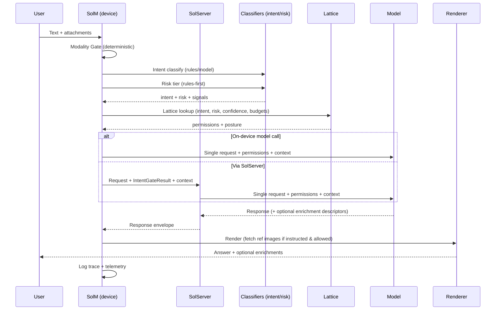

# IntentGate v0.1 (SolM + SolServer)

**Purpose:** Produce a small, versioned, replayable decision about a user turn:
- intent label (+ confidence)
- risk tier (+ rationale signals)
- enrichment permissions (via lattice)
- trace fields for debugging + improvement

**Non-goals (v0.1):**
- No personalization vectors
- No agent loops
- No “UI re-prompts model for enrichment”

---

## Canonical labels (v0.1)

### Intent labels
- `inspect` — evaluate a thing (photo, text, “is this ok?”)
- `teach` — how-to / explain / steps
- `decide` — pick among options / recommendation
- `create` — generate content
- `reflect` — emotional/identity/relational support
- `other` — fallback

### Risk tiers (v0.1)
- `0` harmless
- `1` low
- `2` medium
- `3` high

---

## Contract (JSON)

### `IntentGateResult`
```json
{
  "schema_version": "intentgate.v0.1",
  "decision_id": "uuid",
  "created_at": "2025-12-27T22:10:00Z",

  "modality": {
    "has_text": true,
    "has_image": false,
    "has_audio": false
  },

  "intent": {
    "label": "inspect",
    "confidence": 0.83,
    "signals": [
      {"type":"rule","name":"contains_eval_phrase","value":"still good"},
      {"type":"keyword","name":"food_spoilage","value":true}
    ]
  },

  "risk": {
    "tier": 1,
    "signals": [
      {"type":"rule","name":"domain_food_handling","value":true},
      {"type":"rule","name":"topic_spoilage","value":true}
    ]
  },

  "lattice": {
    "version": "lattice.v0.1",
    "enrichment_mode": "light",
    "allowed_types": ["checklist", "reference_images"],
    "posture": "direct",
    "persona_hint": "Ida"
  },

  "budgets": {
    "max_output_tokens": 900,
    "max_tool_calls": 0,
    "max_seconds": 12
  }
}
```

### Notes
- `signals` are intentionally compact and explainable.
- `persona_hint` is optional; Sole remains the orchestrator at runtime if you route that way.

---

## Risk & write breakpoints

- If `risk.tier >= 2`: set `posture = conditional`, require assumptions, avoid certainty.
- If `risk.tier >= 3`: `posture = boundary_pause|containment`, restrict tools.
- Any `tool_calls_write` requires the separate **write-confirmation breakpoint handshake**.

---

## Implementation: struct drafts

### Swift (SolM)

```swift
import Foundation

// MARK: - Enums

enum IntentLabel: String, Codable {
    case inspect, teach, decide, create, reflect, other
}

enum EnrichmentMode: String, Codable {
    case none, light, full
}

enum Posture: String, Codable {
    case direct
    case conditional
    case boundaryPause = "boundary_pause"
    case containment
}

enum AllowedType: String, Codable {
    case referenceImages = "reference_images"
    case citations
    case checklist
    case stepByStep = "step_by_step"
    case timingTable = "timing_table"
    case toolCallsRead = "tool_calls_read"
    case toolCallsWrite = "tool_calls_write"
}

enum SignalType: String, Codable {
    case rule, keyword, prototype, model
}

// MARK: - Models

struct ModalityFlags: Codable {
    var hasText: Bool
    var hasImage: Bool
    var hasAudio: Bool
}

struct Signal: Codable {
    var type: SignalType
    var name: String
    var value: CodableValue
}

/// Small helper to encode mixed primitive values without building a huge schema.
enum CodableValue: Codable {
    case string(String)
    case bool(Bool)
    case number(Double)

    init(from decoder: Decoder) throws {
        let c = try decoder.singleValueContainer()
        if let b = try? c.decode(Bool.self) { self = .bool(b); return }
        if let n = try? c.decode(Double.self) { self = .number(n); return }
        if let s = try? c.decode(String.self) { self = .string(s); return }
        throw DecodingError.typeMismatch(CodableValue.self, .init(codingPath: decoder.codingPath, debugDescription: "Unsupported CodableValue"))
    }

    func encode(to encoder: Encoder) throws {
        var c = encoder.singleValueContainer()
        switch self {
        case .bool(let b): try c.encode(b)
        case .number(let n): try c.encode(n)
        case .string(let s): try c.encode(s)
        }
    }
}

struct IntentDecision: Codable {
    var label: IntentLabel
    var confidence: Double
    var signals: [Signal]
}

struct RiskDecision: Codable {
    var tier: Int
    var signals: [Signal]
}

struct Budgets: Codable {
    var maxOutputTokens: Int
    var maxToolCalls: Int
    var maxSeconds: Int
}

struct LatticeDecision: Codable {
    var version: String
    var enrichmentMode: EnrichmentMode
    var allowedTypes: [AllowedType]
    var posture: Posture
    var personaHint: String?
}

struct IntentGateResult: Codable {
    var schemaVersion: String
    var decisionId: UUID
    var createdAt: Date

    var modality: ModalityFlags
    var intent: IntentDecision
    var risk: RiskDecision
    var lattice: LatticeDecision
    var budgets: Budgets
}
```

### TypeScript (SolServer / Node)

```ts
export type IntentLabel = "inspect" | "teach" | "decide" | "create" | "reflect" | "other";
export type EnrichmentMode = "none" | "light" | "full";
export type Posture = "direct" | "conditional" | "boundary_pause" | "containment";
export type AllowedType =
  | "reference_images"
  | "citations"
  | "checklist"
  | "step_by_step"
  | "timing_table"
  | "tool_calls_read"
  | "tool_calls_write";

export type SignalType = "rule" | "keyword" | "prototype" | "model";
export type SignalValue = string | boolean | number;

export interface Signal {
  type: SignalType;
  name: string;
  value: SignalValue;
}

export interface ModalityFlags {
  has_text: boolean;
  has_image: boolean;
  has_audio: boolean;
}

export interface IntentDecision {
  label: IntentLabel;
  confidence: number; // 0..1
  signals: Signal[];
}

export interface RiskDecision {
  tier: 0 | 1 | 2 | 3;
  signals: Signal[];
}

export interface Budgets {
  max_output_tokens: number;
  max_tool_calls: number;
  max_seconds: number;
}

export interface LatticeDecision {
  version: string; // e.g. lattice.v0.1
  enrichment_mode: EnrichmentMode;
  allowed_types: AllowedType[];
  posture: Posture;
  persona_hint?: string;
}

export interface IntentGateResult {
  schema_version: "intentgate.v0.1";
  decision_id: string; // uuid
  created_at: string; // ISO 8601

  modality: ModalityFlags;
  intent: IntentDecision;
  risk: RiskDecision;
  lattice: LatticeDecision;
  budgets: Budgets;
}
```

### Python (optional: training/eval service)

```py
from __future__ import annotations
from dataclasses import dataclass
from typing import Literal, Union, List, Optional
from datetime import datetime

IntentLabel = Literal["inspect","teach","decide","create","reflect","other"]
EnrichmentMode = Literal["none","light","full"]
Posture = Literal["direct","conditional","boundary_pause","containment"]
AllowedType = Literal[
    "reference_images","citations","checklist","step_by_step","timing_table",
    "tool_calls_read","tool_calls_write"
]
SignalType = Literal["rule","keyword","prototype","model"]
SignalValue = Union[str,bool,float,int]

@dataclass
class Signal:
    type: SignalType
    name: str
    value: SignalValue

@dataclass
class ModalityFlags:
    has_text: bool
    has_image: bool
    has_audio: bool

@dataclass
class IntentDecision:
    label: IntentLabel
    confidence: float
    signals: List[Signal]

@dataclass
class RiskDecision:
    tier: int
    signals: List[Signal]

@dataclass
class Budgets:
    max_output_tokens: int
    max_tool_calls: int
    max_seconds: int

@dataclass
class LatticeDecision:
    version: str
    enrichment_mode: EnrichmentMode
    allowed_types: List[AllowedType]
    posture: Posture
    persona_hint: Optional[str] = None

@dataclass
class IntentGateResult:
    schema_version: str
    decision_id: str
    created_at: datetime
    modality: ModalityFlags
    intent: IntentDecision
    risk: RiskDecision
    lattice: LatticeDecision
    budgets: Budgets
```

---

## Decision flow sketch (expanded)



---

## Next step (what we draft next)
1) **EnrichmentLattice v0.1 as machine-readable table** (JSON/YAML) + evaluation function
2) **IntentGate implementation** (rules engine + prototype embedding option) behind a stable API:
   - `classify_intent(turn) -> IntentDecision`
   - `classify_risk(turn) -> RiskDecision`
   - `apply_lattice(intent, risk, budgets) -> LatticeDecision`
   - `emit_intent_gate_result(...) -> IntentGateResult`

